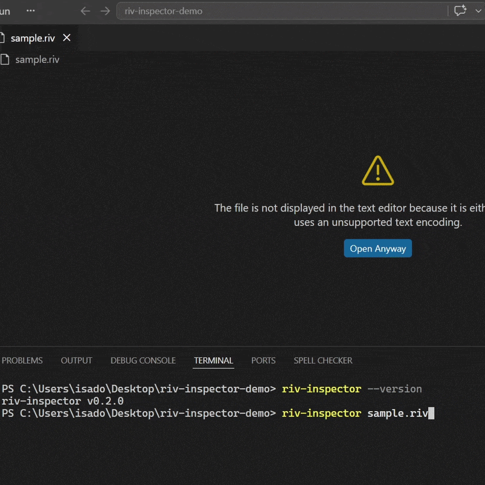

# riv-inspector

[](LICENSE)
[](https://github.com/isaganttus/riv-inspector/actions/workflows/ci.yml)

Extract metadata from `.riv` files and write it as Markdown with YAML frontmatter.

```
riv-inspector <file.riv> [file2.riv ...] [options]
```

---

## What it does

Reads a Rive file without a browser and outputs a `.md` file containing structured YAML describing the file's artboards, state machines, view models, data enums, and assets. Useful for documentation, code generation, or keeping a record of what's inside a `.riv` file.



Example output:

```yaml
---
file: animation.riv
artboards:
  - name: Main
    size: [732, 755]
    origin: [0, 0]
    stateMachines: [sm-main]
  - name: Button
    size: [200, 60]
    origin: [100, 30]
    stateMachines: [State Machine 1]
viewModels:
  - name: Main
    properties:
      - { name: isValid, type: boolean }
      - { name: states, type: enum, enum: States }
    instances: [Instance]
enums:
  - name: States
    values: [idle, active, done]
assets:
  images: [avatar.png]
  fonts: [Inter.ttf]
---
```

---

## Requirements

- **Node.js** v22.6 or later

---

## Installation

**From npm (recommended):**

```bash
npm install -g riv-inspector
```

Or run without installing:

```bash
npx riv-inspector file.riv
```

**From source:**

```bash
git clone https://github.com/isaganttus/riv-inspector.git
cd riv-inspector
npm install
npm run build
npm install -g .
```

---

## Usage

```bash
# Inspect a single .riv file — output defaults to <file>.md next to the input
npm run dev -- path/to/file.riv

# Or using the compiled binary
riv-inspector path/to/file.riv

# Specify a custom output path
riv-inspector path/to/file.riv --output path/to/output.md

# Print to stdout instead of writing a file
riv-inspector path/to/file.riv --stdout

# Output JSON to stdout
riv-inspector path/to/file.riv --json

# Pipe JSON to jq
riv-inspector path/to/file.riv --json | jq '.artboards'

# Output a JSON array for multiple files
riv-inspector a.riv b.riv --json

# Watch a single file for changes
riv-inspector path/to/file.riv --watch

# Inspect all .riv files in a folder
riv-inspector ./assets/

# Inspect all .riv files in a folder as a JSON array
riv-inspector ./assets/ --json

# Watch an entire folder for changes
riv-inspector ./assets/ --watch

# Create a config file and watch using it
riv-inspector --init-config
riv-inspector --watch

# Add a web preview link to the frontmatter
riv-inspector path/to/file.riv --web-preview https://rive.app/community/files/123

# Add an editor link to the frontmatter
riv-inspector path/to/file.riv --editor-link https://rive.app/editor/123

# Inspect multiple files at once
riv-inspector a.riv b.riv c.riv

# Print version
riv-inspector --version
```

---

## Options

| Flag | Alias | Description |
|---|---|---|
| `--output <path>` | `-o` | Output path (single file only) |
| `--stdout` | `-s` | Print Markdown to stdout instead of writing a file (single file only) |
| `--json` | `-j` | Print JSON to stdout; multiple files output a JSON array |
| `--watch` | | Re-inspect on file/folder changes; reads config if no paths given |
| `--init-config` | | Create a starter `.riv-inspector.json` in the current directory |
| `--web-preview <url>` | `-w` | Add a `webPreview` URL to the YAML frontmatter (single file only) |
| `--editor-link <url>` | `-e` | Add an `editorLink` URL to the YAML frontmatter (single file only) |
| `--version` | `-v` | Print version and exit |
| `--help` | `-h` | Show help message |

---

## Output fields

### Artboards

| Field | Description |
|---|---|
| `name` | Artboard name |
| `size` | `[width, height]` in pixels |
| `origin` | `[x, y]` normalized position of the (0,0) anchor (0.0–1.0) |
| `stateMachines` | Names of all state machines on this artboard |

**Origin notes:** `[0, 0]` means the origin is at the top-left corner. `[0.5, 0.5]` means it is centered. `[1, 1]` means it is at the bottom-right corner.

### View Models

| Field | Description |
|---|---|
| `name` | View model name |
| `properties` | List of `{ name, type[, enum] }` entries |
| `instances` | Named instances defined in the file |

Property types mirror the Rive `DataType` enum: `boolean`, `number`, `string`, `color`, `trigger`, `enum`, `list`, `viewModel`, `image`, `artboard`.

### Enums

| Field | Description |
|---|---|
| `name` | Enum name |
| `values` | All possible string values |

### Assets

| Field | Description |
|---|---|
| `images` | Embedded or referenced image asset filenames |
| `fonts` | Embedded or referenced font asset filenames |
| `audio` | Embedded or referenced audio asset filenames |

---

## Development

```bash
npm run dev -- file.riv     # Run from source
npm run build               # Compile TypeScript to dist/
npm test                    # Run tests
npm run typecheck           # Type-check without emitting
```

---

## Config file

`riv-inspector --init-config` creates a `.riv-inspector.json` in the current directory:

```json
{
  "watch": ["./"]
}
```

Run `riv-inspector --watch` with no positional arguments to watch all paths listed in the config. Paths are relative to where you run the command. The config file is gitignored by default.

---

## How it works

The WASM runtime from `@rive-app/canvas-advanced` is loaded in Node.js with a minimal browser-global polyfill (no canvas, no WebGL). The `.riv` binary is parsed entirely in memory by the Rive C++ runtime compiled to WASM. No network requests are made.

---

## Project structure

```
src/
  index.ts       CLI entry point — argument parsing and file I/O
  config.ts      Config file loading (.riv-inspector.json)
  inspector.ts   Loads the Rive WASM runtime and extracts metadata
  formatter.ts   Serialises RivMetadata to Markdown/YAML frontmatter
test/
  inspector.test.ts    Integration tests using node:test
  fixtures/
    sample.riv         Your .riv file goes here (not committed)
```

---

## Contributing

See [CONTRIBUTING.md](CONTRIBUTING.md) for development setup, test instructions, and PR guidelines.

Please note that this project follows a [Code of Conduct](CODE_OF_CONDUCT.md). By participating, you agree to uphold it.

---

## License

MIT
